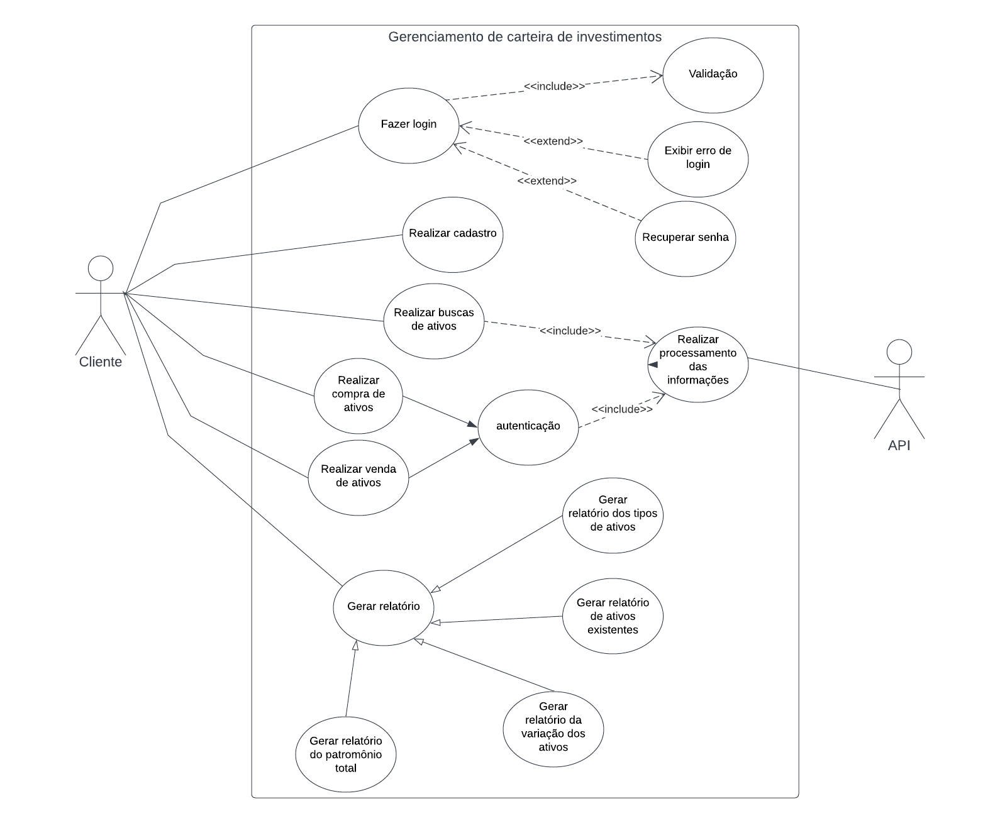

# Especificações do Projeto

Pré-requisitos: <a href="1-Documentação de Contexto.md"> Documentação de Contexto</a>

Definição do problema e ideia de solução a partir da perspectiva do usuário. É composta pela definição do  diagrama de personas, histórias de usuários, requisitos funcionais e não funcionais além das restrições do projeto.

Apresente uma visão geral do que será abordado nesta parte do documento, enumerando as técnicas e/ou ferramentas utilizadas para realizar a especificações do projeto

## Personas

- João, 22 anos: estudante universitário que gosta de esportes, finanças e tecnologia. Ele é uma pessoa extrovertida. João está sempre procurando maneiras de se manter atualizado com as últimas tendências tecnológicas e de esportes, e está sempre buscando novas experiências e aventuras.

-Bárbara, 35 anos: mãe de dois filhos, que trabalha em tempo integral como professora em uma universidade. Ela é uma pessoa ocupada, mas organizada e eficiente, que valoriza o equilíbrio entre sua vida profissional e a vida pessoal. Bárbara adora sair com sua família e amigos nos finais de semana, ela está se interessando pelo mercado financeiro preocupa em manter-se atualizada.

-Helena, 44 anos: empresária e empreendedora, que fundou sua própria empresa de tecnologia. Ela é uma pessoa motivada e determinada, que trabalha duro para alcançar seus objetivos. Helena está sempre procurando novas oportunidades de negócios e busca sempre se adaptar às mudanças do mercado. Ela também valoriza a saúde e o bem-estar, e gosta de praticar atividades físicas.

-Felipe, 50 anos: pai, CEO de um startup no ramo de tecnologia está indo muito tempo nos negócios. Ele é uma pessoa com muitos anos de experiência. Felipe se preocupa com o bem-estar de sua equipe e valoriza a comunicação aberta e honesta. Ele também gosta de aprender sobre investimentos nas horas vagas e costuma praticar atividades físicas e esportes com sua família. 

-Beatriz, 60 anos: aposentada, que agora se dedica a viajar pelo mundo e explorar novas culturas. Ela é uma pessoa curiosa e aventureira, que adora aprender novas coisas e experimentar novas experiências. Beatriz também se preocupa com a sustentabilidade e a conservação ambiental, e gosta de viajar de forma consciente e responsável. Ela também é uma pessoa social e gosta de fazer amizades onde quer que vá.

## Histórias de Usuários

| EU COMO... `PERSONA`    | QUERO/PRECISO ... `FUNCIONALIDADE`                 | PARA ... `MOTIVO/VALOR`                              |
|-------------------------|----------------------------------------------------|------------------------------------------------------|
| Estudante universitário | Acompanhar meus investimentos                      | Não ter problemas financeiros no futuro              |
| Estudante universitário | Acompanhar meus rendimentos                        | Poder planejar a aquisição de bens materiais         |
| Mãe e trabalhadora      | Registrar meus investimentos                       | Poder planejar uma viagem com meus filhos            |
| Mãe e trabalhadora      | Ter o rendimento em tempo real dos meus investimentos | Poder tomar descisões de compra/venda de ativos   |
| Aposentada              | Visualizar meu patrimônio                          | Poder decidir qual o destino da minha próxima viagem |
| Aposentada              | Visualizar meus resgates                           | Poder investir melhor em outro(s) ativo(s)           |
| Empresária              | Gerenciar o dinheiro investido                     | Saber quanto estou recebendo           |
| Empresária              | Saber onde investir                                | Devolver para a minha empresa          |
| CEO                     | Coordenar meus investimentos                       | Investir conscientemente               |
| CEO                     | Saber o meu valor total investido                  | Gerenciar melhor minhas fontes de renda|

## Requisitos

As tabelas que se seguem apresentam os requisitos funcionais e não funcionais que detalham o escopo do projeto.

### Requisitos Funcionais

|ID    | Descrição do Requisito  | Prioridade |
|------|-----------------------------------------|----|
|RF-01| Permitir ao usuário realizar o cadastro na plataforma. | ALTA | 
|RF-02| Permitir a busca por nomes e tipos de ativos.   | ALTA |
|RF-03| Registrar a compra e venda de ativos.   | ALTA |
|RF-04| Dashboard principal com recurso visual, identificando por tipos de ativos   | ALTA |
|RF-05| Geração de relatórios para acompanhamento dos ativos em carteira.   | MÉDIA |
|RF-06| Geração de relatório para acompanhamento dos ativos em carteira.   | MÉDIA |
|RF-07| Geração de relatório de patrimônio total, investido ou liquidado.  | MÉDIA |
|RF-08| Permitir o acompanhamento do valor dos ativos.   | BAIXA |

### Requisitos não Funcionais

|ID     | Descrição do Requisito  |Prioridade |
|-------|-------------------------|----|
|RNF-01| O site deve ser publicado em um ambiente acessível publicamente na Internet (Repl.it, GitHub Pages, Heroku)  | ALTA | 
|RNF-02| O site deve ser compatível com os principais navegadores do mercado (Google Chrome, Firefox, Microsoft Edge) |  ALTA | 
|RNF-03| O site deve ter bom nível de contraste entre os elementos da tela em conformidade. |  ALTA |
|RNF-04| O site deve ser desenvolvido com layout simples, organizado e intuitivo. |  ALTA |

## Restrições

O projeto está restrito pelos itens apresentados na tabela a seguir.

|ID| Restrição                                             |
|--|-------------------------------------------------------|
|RE-01| O projeto deve ser entregue até o final do semestre |
|RE-02| A equipe do projeto não poderá subcontratar o desenvolvimento do projeto.        |

## Diagrama de Casos de Uso

O diagrama de casos de uso é o próximo passo após a elicitação de requisitos, que utiliza um modelo gráfico e uma tabela com as descrições sucintas dos casos de uso e dos atores. Ele contempla a fronteira do sistema e o detalhamento dos requisitos funcionais com a indicação dos atores, casos de uso e seus relacionamentos. 

As referências abaixo irão auxiliá-lo na geração do artefato “Diagrama de Casos de Uso”.

