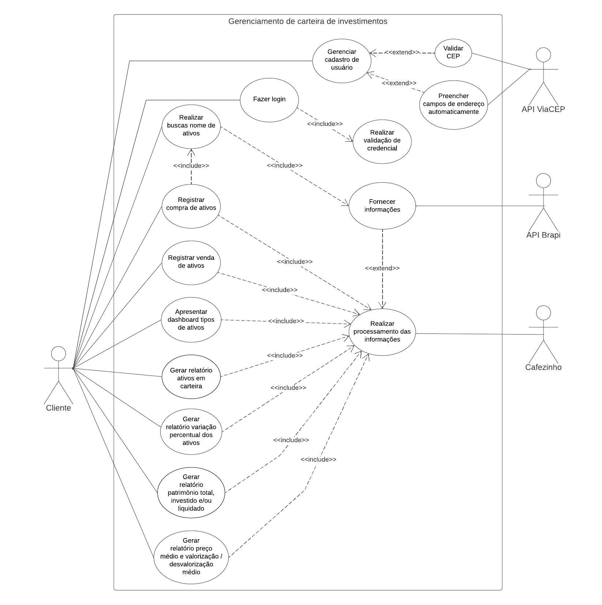

# Especificações do Projeto

A escolha do problema foi definida por meio de discussões e estudos realizados pelos membros da equipe.  
Os detalhes levantados nesse processo foram consolidados na forma de personas e histórias de usuários.

## Personas

`João`: 22 anos, estudante universitário que gosta de esportes, finanças e tecnologia. Ele é uma pessoa extrovertida. João está sempre procurando maneiras de se manter atualizado com as últimas tendências tecnológicas e de esportes, e está sempre buscando novas experiências e aventuras.

`Bárbara`: 35 anos, mãe de dois filhos, que trabalha em tempo integral como professora em uma universidade. Ela é uma pessoa ocupada, mas organizada e eficiente, que valoriza o equilíbrio entre sua vida profissional e a vida pessoal. Bárbara adora sair com sua família e amigos nos finais de semana, ela está se interessando pelo mercado financeiro preocupa em manter-se atualizada.

`Helena`: 44 anos, empresária e empreendedora, que fundou sua própria empresa de tecnologia. Ela é uma pessoa motivada e determinada, que trabalha duro para alcançar seus objetivos. Helena está sempre procurando novas oportunidades de negócios e busca sempre se adaptar às mudanças do mercado. Ela também valoriza a saúde e o bem-estar, e gosta de praticar atividades físicas.

`Felipe`: 50 anos, pai, CEO de um startup no ramo de tecnologia está indo muito tempo nos negócios. Ele é uma pessoa com muitos anos de experiência. Felipe se preocupa com o bem-estar de sua equipe e valoriza a comunicação aberta e honesta. Ele também gosta de aprender sobre investimentos nas horas vagas e costuma praticar atividades físicas e esportes com sua família. 

## Histórias de Usuários

| EU COMO... `PERSONA`    | QUERO/PRECISO ... `FUNCIONALIDADE`                 | PARA ... `MOTIVO/VALOR`                              |
|-------------------------|----------------------------------------------------|------------------------------------------------------|
| Estudante universitário | Acompanhar meus investimentos                      | Não ter problemas financeiros no futuro              |
| Estudante universitário | Acompanhar a variação percentual dos ativos em carteira | Poder planejar a aquisição de bens materiais    |
| Estudante universitário | Visualizar meus ativos                                   | Poder decidir quais papeis adquirir no futuro  |
| Mãe e trabalhadora      | Registrar meus investimentos                       | Poder planejar uma viagem com meus filhos            |
| Mãe e trabalhadora      | Ter a cotação em tempo real dos meus ativos       | Poder tomar descisões de compra/venda de ativos      |
| Mãe e trabalhadora      | Acompanhar meus investimentos                            | Visualizar minha reserva de emergência         |
| Empresária              | Gerenciar o dinheiro investido                     | Saber quanto estou recebendo           |
| Empresária              | Saber onde investir                                | Devolver para a minha empresa          |
| Empresária              | Visualizar meu patrimônio                          | Para decidir quanto eu posso retirar para a proxima viagem |
| CEO                     | Coordenar meus investimentos                       | Investir conscientemente               |
| CEO                     | Para saber a valorização patrimonial ao longo dos meses| Saber a cotação dos ativos para saber onde investir|
| CEO                     | Visualizar meus resgates                           | Poder investir melhor em outro(s) ativo(s)      |

## Requisitos

As tabelas que se seguem apresentam os requisitos funcionais e não funcionais, que detalham o escopo do projeto.

### Requisitos Funcionais

|ID    | Descrição do Requisito  | Prioridade |
|------|-----------------------------------------|----|
|RF-01| Permitir ao usuário realizar o cadastro na plataforma. | ALTA |
|RF-02| Permitir ao usuário realizar o login na plataforma. | ALTA |
|RF-03| Realizar a validação de credenciais do usuário. | ALTA | 
|RF-04| Permitir que o usuário possa solicitar a recuperação de senha. | ALTA |
|RF-05| Permitir a busca por nomes e tipos de ativos. | ALTA |
|RF-06| Permitir que o usuário gerencie sua carteira de investimentos. | ALTA |
|RF-07| Registrar a compra e venda de ativos. | ALTA |
|RF-08| Realizar o processamento das informações solicitadas pelo usuário. | ALTA |
|RF-09| Apresentar dashboard principal com recurso visual, identificando por tipos de ativos. | ALTA |
|RF-10| Gerar relatório para acompanhamento dos ativos em carteira. | MÉDIA |
|RF-11| Gerar relatório para acompanhamento da variação percentual dos ativos em carteira. | MÉDIA |
|RF-12| Gerar relatório de patrimônio total, investido e/ou liquidado. | MÉDIA |
|RF-13| Gerar relatório de preço médio e valorização/desvalorização médio, de um ativo da carteira do usuário. | MÉDIA |
|RF-14| Gerar relatório para acompanhamento da cotação dos ativos em tempo real. | BAIXA |
|RF-15| Realizar a autenticação das movimentações em carteira do usuário. | BAIXA |

### Requisitos não Funcionais

|ID     | Descrição do Requisito  |Prioridade |
|-------|-------------------------|----|
|RNF-01| O site deve ser publicado em um ambiente acessível publicamente na Internet (Repl.it, GitHub Pages, Heroku).  | ALTA | 
|RNF-02| O site deve ser compatível com os principais navegadores do mercado (Google Chrome, Firefox, Microsoft Edge). | ALTA |
|RNF-03| A aplicação deverá ser responsiva permitindo a visualização em diversos dispositivos de forma adequada. | ALTA |
|RNF-04| O site deve ter bom nível de contraste entre os elementos da tela em conformidade. | ALTA |
|RNF-05| O site deve ser desenvolvido com layout simples, organizado e intuitivo. | ALTA |
|RNF-06| A aplicação deve se comunicar com o banco de dados SQL. | ALTA | 
|RNF-07| A aplicação deve estár acessível e sem interrupções por pelo menos 95% do tempo, apresentando um tempo de inatividade mínimo. | ALTA | 

## Restrições

O projeto está restrito pelos itens apresentados na tabela a seguir.

|ID| Restrição                                             |
|--|-------------------------------------------------------|
|RE-01| O projeto deve ser entregue até o final do semestre. |
|RE-02| A equipe do projeto não poderá subcontratar o desenvolvimento do projeto. |

## Diagrama de Casos de Uso

O diagrama de casos de uso contempla as principais ligações entre os atores e os casos de uso, além de permitir identificar os requisitos funcionais apresentados anteriormente.

Foi utilizada a ferramenta [Lucidchart](https://www.lucidchart.com/) para elaborar o diagrama de casos de uso.
