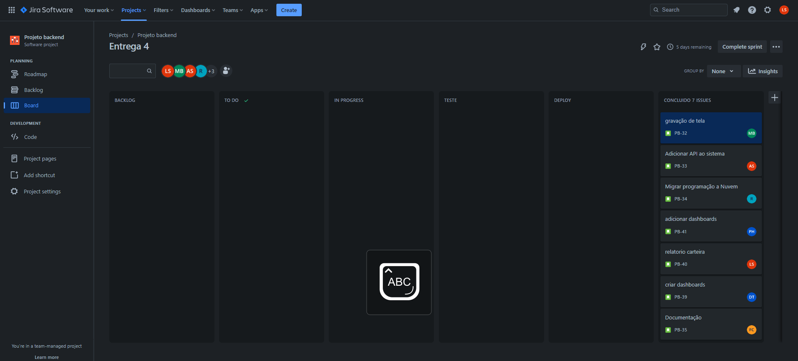

# Metodologia

A metodologia contempla as definições de ferramental utilizado pela equipe tanto para a manutenção dos códigos e demais artefatos quanto para a organização do time na execução das tarefas do projeto.

## Controle de Versão

A ferramenta de controle de versão adotada no projeto foi o
[Git](https://git-scm.com/), sendo o [Github](https://github.com) utilizado para hospedagem do repositório.
[Git](https://git-scm.com/), sendo o [Github](https://github.com) utilizado para hospedagem do repositório.

O projeto segue a seguinte convenção para o nome de branches:

- `main`: versão estável já testada do software
- `dev`: versão de desenvolvimento do software

Convencionou-se que os commits com alterações seriam feitas na branch `dev`, a partir de branches criadas pelos integrantes do grupo e só depois as alterações já em funcionamento na `dev` é feito o merge para a `main`. 
Convencionou-se que os commits com alterações seriam feitas na branch `dev`, a partir de branches criadas pelos integrantes do grupo e só depois as alterações já em funcionamento na `dev` é feito o merge para a `main`. 

## Gerenciamento de Projeto

### Divisão de Papéis

A  equipe do cafezinho utiliza metodologias ágeis,  escolhendo o Scrum como base para definição do processo de desenvolvimento.

A equipe está organizada da seguinte maneira: 
* Scrum Master: Diego Ruas Toledo
* Product Owner: Ronald Justino Costa 
* Equipe de Desenvolvimento
  * Pedro Henrique Pinto 
  * Lucas Delmasquio Silva
  * Amanda de Almeida Silva
  * Mateus Borges Martins da Silva
* Equipe de Design: Flávio Martins da Cruz

O quadro kanban  que está sendo utilizado pode ser acessado através da URL(https://pucminasinfosec.atlassian.net/jira/software/projects/PB/boards/2) é apresentado, no estado atual:

### Processo

Para organização e distribuição das tarefas do projeto, a equipe está utilizando o Jira - Project estruturado com as seguintes listas:  

* `Backlog`: Recebe as tarefas a serem trabalhadas e representa o Product Backlog. Todas as atividades identificadas no decorrer do projeto também devem ser incorporadas a esta lista.
* `To Do`: Esta lista representa o Sprint Backlog. Esta etapa e onde ocorre o estudo das atividades e o que sera feito.
* `In progress`: Quando uma tarefa tiver sido iniciada, ela é movida para cá. 
* `Test`: Checagem de qualidade. Ao certificar que a tarefa foi finalizada e está em teste, é movida para esta coluna.
* `Deploy`: Esta etapa a tarefa é implementada ao projeto porém ainda podendo sofrer alguma alteração.
* `Done`: Nesta lista são colocadas as tarefas que passaram pelos testes e controle de qualidade e estão prontos para ser entregues ao usuário. Não há mais edições ou revisões necessárias, ele está agendado e pronto para a ação. 

### Ferramentas

As ferramentas empregadas no projeto são:

- Visual Studio
- Visual Studio Code
- Microsoft Teams
- Whatsapp
- Discord
- Google Meet
- Moqups app, para de esquematização de telas (wireframing)
- Jira
- API [ViaCEP](https://viacep.com.br/)
- API [Brapi](https://brapi.dev/)

Visual Studio e Visual Studio Code foram escolhidos porque eles possuem uma integração direta com o sistema de versionamento. As ferramentas de comunicação utilizadas possuem integração semelhante e por isso foram selecionadas.  
Para criar diagramas, utilizamos o site moqups.com, por melhor captar as necessidades da nossa solução.