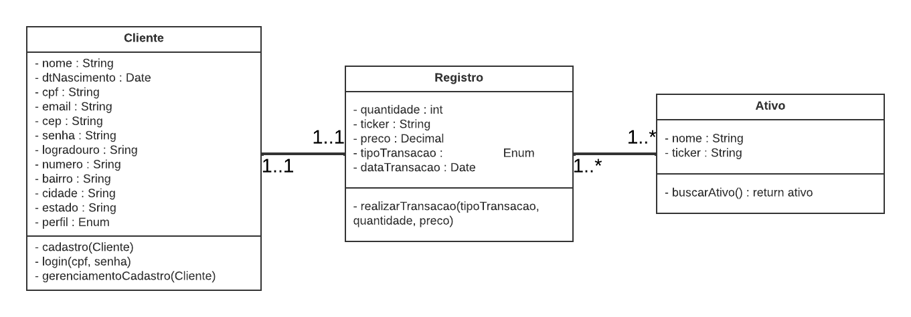
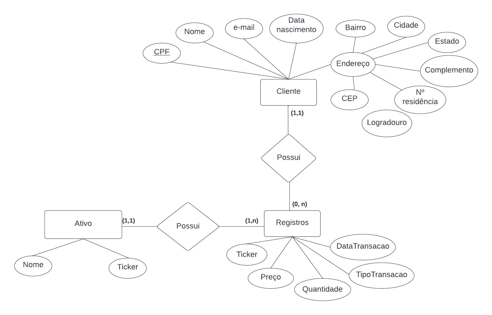
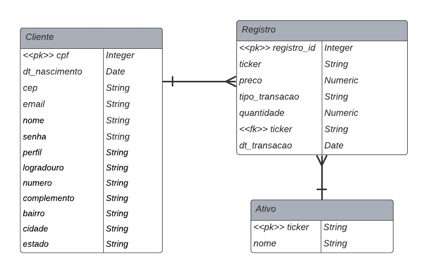

# Arquitetura da Solução

Definição de como o software é estruturado em termos dos componentes que fazem parte da solução e do ambiente de hospedagem da aplicação.

## Diagrama de Classes

O diagrama de classes ilustra graficamente como será a estrutura do software, e como cada uma das classes da sua estrutura estarão interligadas. Essas classes servem de modelo para materializar os objetos que executarão na memória.

## Modelo ER (Projeto Conceitual)

O Modelo ER representa através de um diagrama como as entidades (coisas, objetos) se relacionam entre si na aplicação interativa.

## Projeto da Base de Dados

O projeto da base de dados corresponde à representação das entidades e relacionamentos identificadas no Modelo ER, no formato de tabelas, com colunas e chaves primárias/estrangeiras necessárias para representar corretamente as restrições de integridade.
 

## Tecnologias Utilizadas

* HTML, CSS, JavaScript, C#;
* Git, GitHub, Jira e Github Projects;
* Visual Studio Code e Visual Studio;
* Microsoft Teams, Whatsapp, Google Meet e Discord;
* Moqups app.
* API [ViaCEP](https://viacep.com.br/)
* API [Brapi](https://brapi.dev/)

## Hospedagem

A hospedagem da aplicação e do banco de dados foram feitas usando a plataforma Azure.  
Para conferir a nossa aplicação, acesse [https://cafezinhonet.azurewebsites.net](https://cafezinhonet.azurewebsites.net/)
