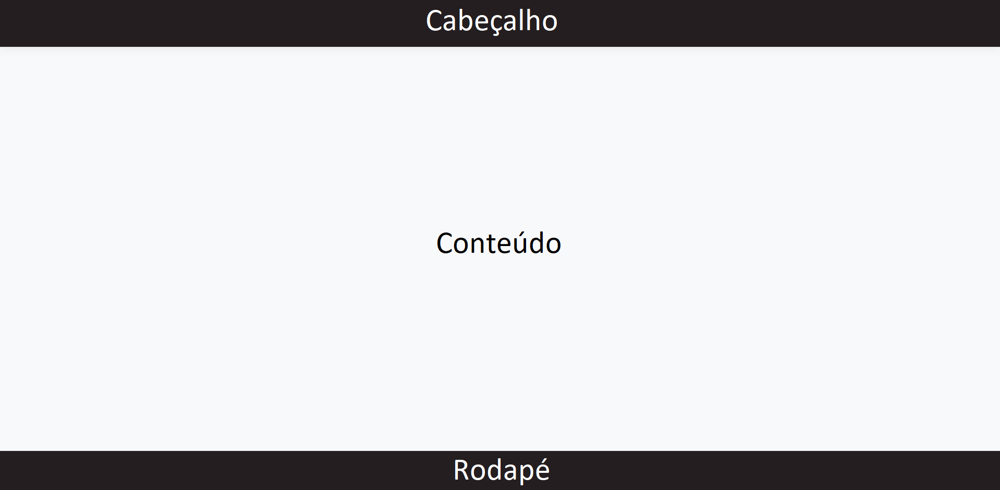

# Template Padrão da Aplicação

Todas as páginas são apresentadas com cabeçalho, conteúdo e rodapé:

#####Cores:  
Todas as cores apresentadas estão no padrão  hexadecimal.
Cabeçalho e rodapé na cor #241E20, que é a mesma cor da xícara de café existente no logotipo.  
Área de conteúdo na cor #F8F9FA.  

Botões nas cores #198754, #FFC107, #DC3545, #6C757D e #0D6EFD.  
 

#####Exemplo de tela: Relação de ativos cadastrados  

#####Fonte utilizada

Para todo o projeto, foi utilizada a família de fontes [Segoe UI](https://learn.microsoft.com/pt-br/typography/font-list/segoe-ui).  

 
