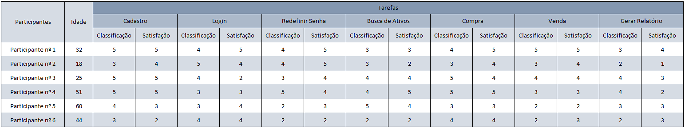

# Registro de Testes de Usabilidade

Após toda a realização do plano de testes, os participantes receberam uma planilha para classificar a experiência com a aplicação.

Para cada tarefa executada, os participantes classificaram em niveis de satisfação e dificuldade.

`Classificando por dificuldade:` 

| **Escala** | **Classificação** |
| :---: | :--- |
| 1 | Extremamente Difícil |
| 2 | Muito Difícil |
| 3 | Moderado |
| 4 | Fácil |
| 5 | Muito Fácil |

`Classificando por satisfação:`

| **Escala** | **Classificação** |
| :---: | :--- |
| 1 | Muito Insatisfeito |
| 2 | Insatisfeito |
| 3 | Neutro |
| 4 | Satisfeito |
| 5 | Muito Satisfeito |

Os registros abaixo mostram as respostas dos participantes e indicam como foi a experiência com a aplicação.

