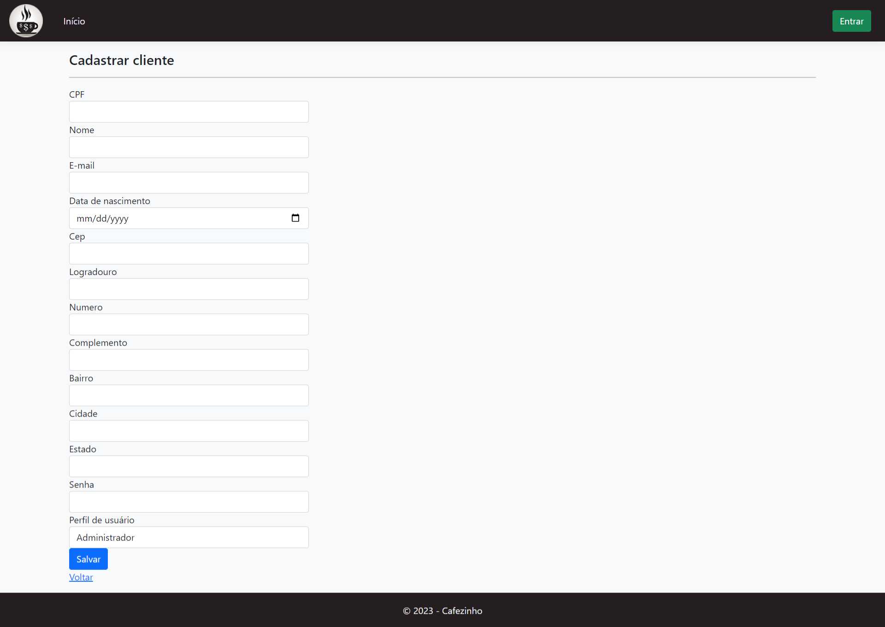
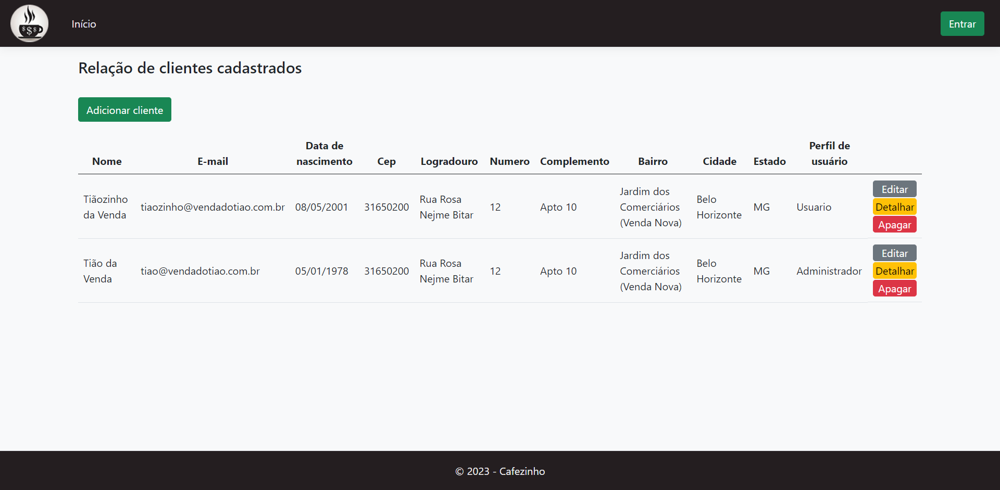
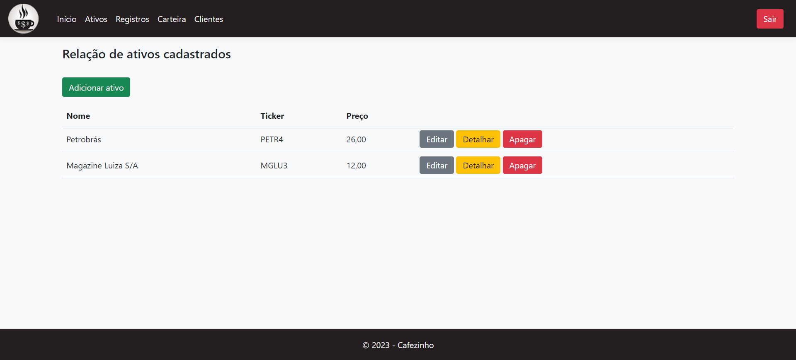
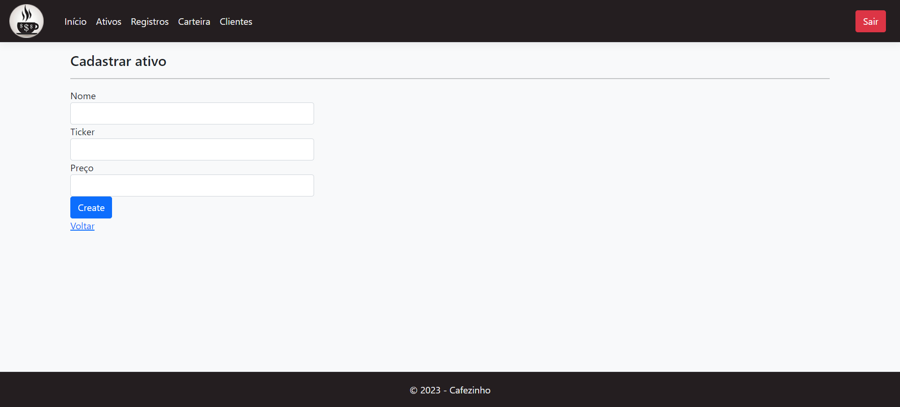
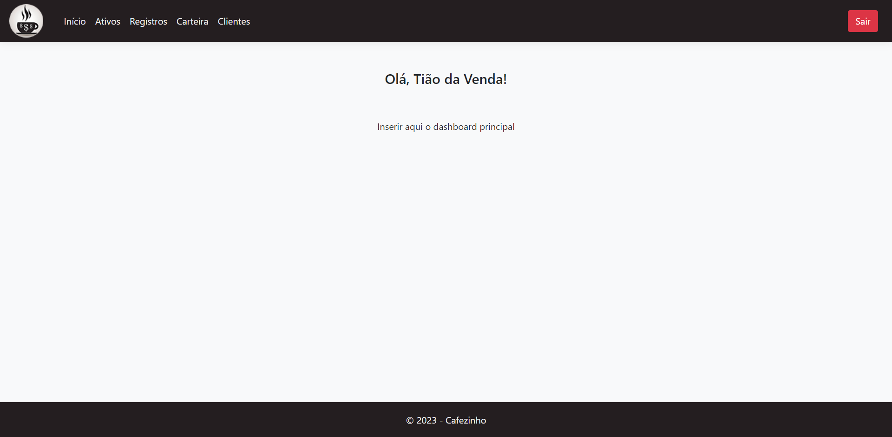

# Registro de Testes de Software

Segue abaixo o relatório com os resultados obtidos seguindo o plano de testes pré-definido.

## Caso de teste 01 - Cadastro
* Requisito Funcional relacionado: RF-01

## Caso de Teste 02 - Login
* Requisito Funcional relacionado: RF-02

## Caso de Teste 03 - Recuperar Senha
* Requisito Funcional relacionado: RF-04

## Caso de Teste 04 - Buscar Ativos
 * Requisito Funcional relacionado: RF-05

### **Nesta versão, a aplicação permite apenas a adição do ativo manualmente, pois a API ainda está sendo implementada.**

## Caso de Teste 05 - Compra
* Requisito Funcional relacionado: RF-07

## Caso de Teste 06 - Venda
* Requisito Funcional relacionado: RF-08

## Caso de Teste 07 - Dashboard
* Requisito Funcional relacionado: RF-010

## Caso de Teste 08 - Relatórios
* Requisito Funcional relacionado: RF-11/12/13/14

